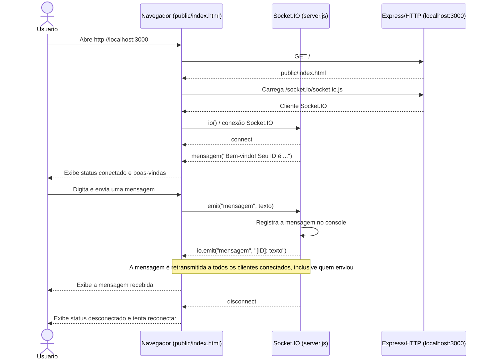

# Diagrama de comunicação

```mermaid
sequenceDiagram
    actor Usuario
    participant Cliente as Navegador (public/index.html)
    participant Socket as Socket.IO (server.js)
    participant Servidor as Express/HTTP (localhost:3000)

    Usuario->>Cliente: Abre http://localhost:3000
    Cliente->>Servidor: GET /
    Servidor-->>Cliente: public/index.html
    Cliente->>Servidor: Carrega /socket.io/socket.io.js
    Servidor-->>Cliente: Cliente Socket.IO
    Cliente->>Socket: io() / conexão Socket.IO
    Socket-->>Cliente: connect
    Socket-->>Cliente: mensagem("Bem-vindo! Seu ID é ...")
    Cliente-->>Usuario: Exibe status conectado e boas-vindas

    Usuario->>Cliente: Digita e envia uma mensagem
    Cliente->>Socket: emit("mensagem", texto)
    Socket->>Socket: Registra a mensagem no console
    Socket-->>Cliente: io.emit("mensagem", "[ID]: texto")
    Note over Socket,Cliente: A mensagem é retransmitida a todos os clientes conectados, inclusive quem enviou
    Cliente-->>Usuario: Exibe a mensagem recebida

    Socket-->>Cliente: disconnect
    Cliente-->>Usuario: Exibe status desconectado e tenta reconectar
```

O navegador e o servidor usam o mesmo endereço (`localhost:3000`). As mensagens trafegam pelo Socket.IO; o Express entrega os arquivos estáticos da pasta `public`.
